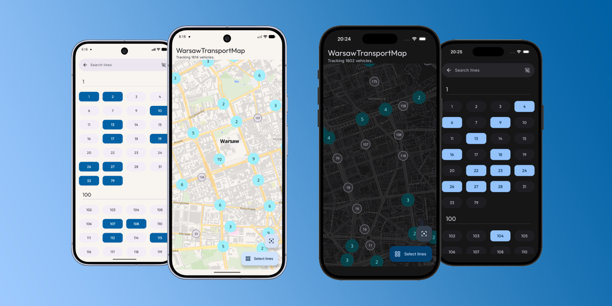

<h1>WarsawTransportMap</h1>

## About
**WarsawTransportMap** is a **Compose Multiplatform** app for **tracking live positions of public transport vehicles** in Warsaw which utilizes [UM](https://api.um.warszawa.pl/) API.

## Features
- **Shared UI** in Jetpack Compose
- **Live map updates** showing current vehicles' positions
- **Line selection** list
- **Dynamic** light/dark **themes**

## Used technologies
- [Compose Multiplatform](https://github.com/JetBrains/compose-multiplatform) - declarative UI framework for shared Android and iOS user interfaces
- [Navigation 3](https://developer.android.com/jetpack/androidx/releases/navigation) - screen flows and navigation management in Compose Multiplatform
- [MapLibre Compose](https://github.com/maplibre/maplibre-compose) - interactive maps for Jetpack Compose and Compose Multiplatform
- [Koin](https://insert-koin.io/) - lightweight dependency injection framework
- [Ktor](https://ktor.io/) - asynchronous HTTP client for multiplatform network requests
- [Coroutines](https://kotlinlang.org/docs/coroutines-guide.html) - asynchronous and concurrent programming
- [DataStore](https://developer.android.com/topic/libraries/architecture/datastore) - on-device data storage solution for key-value pair preferences
- [Kotlinx Serialization](https://github.com/Kotlin/kotlinx.serialization) - Kotlin multiplatform JSON serialization and deserialization